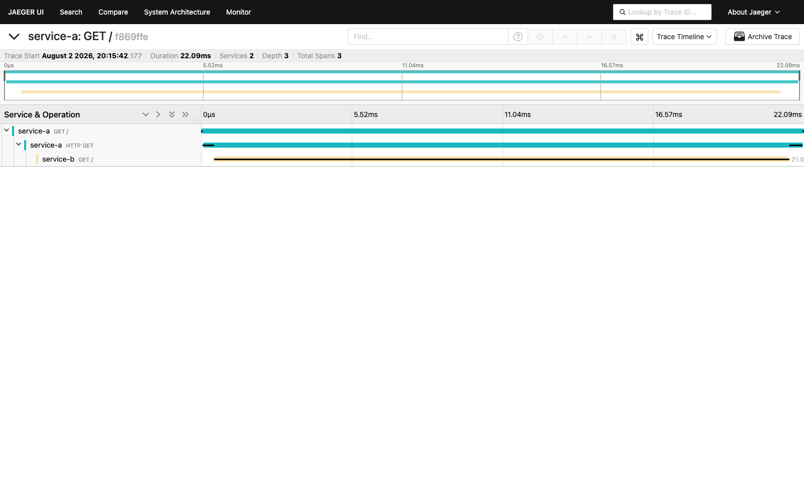

# Архитектурное решение по трейсингу

## Контекст и границы решения

Заказ проходит через Shop API, CRM API и MES API, а данные о нём хранятся в двух базах и S3. CRM и MES обмениваются сообщениями через RabbitMQ. Именно этот асинхронный участок наиболее опасен: успешный ответ одной системы ещё не означает, что сообщение дошло, было обработано и привело к изменению статуса в другой системе.

Трейсингом нужно покрыть в первую очередь серверные части Shop API, CRM API и MES API, их обращения к PostgreSQL и S3, а также публикацию и обработку сообщений RabbitMQ. Клиентские приложения можно подключить на втором этапе, чтобы видеть задержки до входа в API, но это не должно задерживать наблюдаемость основного пути заказа.

## Где заказ может сломаться или зависнуть

1. **Создание и отправка заказа в Shop API.** Запрос может завершиться ошибкой или таймаутом, заказ может сохраниться в Shop DB не полностью, а повторный запрос клиента — создать дубликат.
2. **Загрузка 3D-модели в S3.** Файл может не загрузиться, ссылка на него может не записаться в базу или MES может получить недоступную ссылку.
3. **Передача заказа из интернет-магазина в MES.** Синхронный вызов может завершиться таймаутом после фактической обработки, поэтому отправитель не понимает, нужно ли повторять запрос.
4. **Приём заказа от внешнего пользователя API в MES.** Ошибка валидации, ограничение ресурса или повтор запроса могут остановить заказ до создания записи в CRM.
5. **Расчёт стоимости в MES.** Обычный расчёт занимает 2–3 минуты, сложный — до 30 минут. Он может зависнуть на обработке модели, закончиться ошибкой или удерживать ресурсы так долго, что остальные запросы будут ждать.
6. **Публикация сообщения в RabbitMQ.** Изменение уже могло попасть в базу, а публикация — не состояться. Без publisher confirms и шаблона transactional outbox возникает разрыв между состоянием БД и очереди.
7. **Нахождение сообщения в очереди.** Сообщение может долго ждать свободного consumer, многократно переотправляться, попасть в dead-letter queue или истечь по TTL.
8. **Обработка сообщения CRM или MES.** Consumer может упасть после получения сообщения, не подтвердить его, обработать повторно или подтвердить до сохранения результата.
9. **Изменение статуса в CRM или MES.** Транзакция БД может откатиться, переход может оказаться недопустимым, а статусы одного заказа в Shop DB и MES DB — разойтись.
10. **Ожидание ручного действия.** Заказ может слишком долго оставаться в `MANUFACTURING_APPROVED`, `MANUFACTURING_STARTED`, `PACKAGING` или другом статусе, хотя технических ошибок нет.
11. **Завершение доставки.** Событие транспортной компании может не прийти, из-за чего отправленный заказ не перейдёт из `SHIPPED` в `CLOSED`.

Трейсинг показывает технический путь и длительность обработки. Для надёжной доставки сообщений он должен дополнять, а не заменять publisher confirms, retry с ограничением числа попыток, dead-letter queue, идемпотентных consumers и transactional outbox.

## Данные, которые должны попадать в трейсинг

### Ресурс сервиса

- `service.name`, `service.version`, `deployment.environment`;
- имя и версия OpenTelemetry SDK;
- идентификатор экземпляра приложения или Kubernetes pod;
- регион и зона размещения без внутренних секретных адресов.

### Контекст и идентификаторы

- `trace_id`, `span_id`, `parent_span_id`, флаг sampling;
- `order.id` — внутренний непрозрачный идентификатор заказа;
- `correlation_id` — идентификатор всей операции или цепочки сообщений;
- `message.id` и номер попытки обработки;
- тип канала создания заказа: `b2c`, `partner_api`;
- текущий и следующий статус заказа.

### HTTP

- сервис, метод, шаблон маршрута, код ответа;
- время начала и длительность;
- адрес вызываемого сервиса, тип и размер ответа;
- признак таймаута, отмены или повторной попытки;
- исключение: тип, безопасное сообщение и stack trace для ошибки;
- контекст W3C Trace Context из заголовка `traceparent`.

Полные URL с query-параметрами, тела запросов и ответов в spans не записываются.

### RabbitMQ

- exchange, routing key и имя очереди;
- операция `publish`, `deliver`, `process`, `ack`, `nack`;
- `message_id`, `correlation_id`, количество повторов;
- возраст сообщения на момент обработки;
- результат publisher confirm;
- переход в dead-letter queue и причина;
- размер сообщения без его содержимого;
- `traceparent`, `trace_id` и `correlation_id` в headers сообщения.

### Базы данных, S3 и бизнес-операции

- тип БД, имя логической базы и операция без значений параметров;
- длительность запроса, число затронутых строк, результат транзакции;
- операция с S3, имя bucket и безопасный идентификатор объекта, код результата;
- начало и конец расчёта стоимости, число полигонов в виде диапазона, длительность и результат;
- событие смены статуса: `order.status.changed`, предыдущий и новый статус;
- длительность нахождения заказа на этапе и установленный для этапа срок;
- результат проверки допустимости перехода.

### Запрещённые данные

В трейсинг нельзя передавать ФИО, телефоны, электронную почту, адрес доставки, платёжные данные, токены, cookie, пароли, API-ключи, содержимое 3D-файлов, тела сообщений и SQL-параметры. `order.id` и `correlation_id` должны быть случайными непрозрачными значениями, по которым нельзя восстановить сведения о клиенте.

## Мотивация

Сейчас сотрудники узнают о задержке после жалобы клиента и восстанавливают события вручную по нескольким системам. Распределённый трейсинг свяжет HTTP-вызовы, операции с БД и обработку сообщений в одну наблюдаемую цепочку. Поддержка сможет найти заказ по безопасному `order.id` или `correlation_id`, увидеть последнюю успешную операцию, очередь или сервис с ошибкой и передать разработчикам точный `trace_id`.

Для бизнеса это сокращает число просроченных заказов и потери контрактов. Для команды — уменьшает время диагностики, показывает реальную длительность каждого этапа и позволяет отличить медленное производство от технической задержки.

### Метрики эффекта

1. **Среднее время диагностики инцидента с заказом (MTTR):** от регистрации обращения до определения сервиса и операции, где остановился заказ. Цель после внедрения — сократить не менее чем на 50%.
2. **Доля заказов с полной наблюдаемой цепочкой:** заказы, у которых есть spans для всех пройденных технических этапов, к общему числу заказов. Цель — не менее 99%.
3. **Доля заказов, превысивших допустимое время этапа:** отдельно по статусу и каналу создания. Цель — устойчивое снижение после включения автоматического контроля.
4. **Количество потерянных или необработанных сообщений:** сообщения без ожидаемого consumer span либо попавшие в DLQ. Цель — отсутствие потерь и уменьшение DLQ-инцидентов.
5. **Доля обращений поддержки, решённых без эскалации разработчику:** должна расти благодаря поиску по `order.id`, `correlation_id` и готовой временной шкале.

Начальные значения фиксируются за две недели до включения алертов. Целевые значения уточняются после месяца наблюдений.

## Предлагаемое решение

[Базовая диаграмма трейсинга](./tracing-base-solution.drawio)

### Компоненты

1. В Shop API и CRM API устанавливаются OpenTelemetry Java Agent и OpenTelemetry SDK для ручных бизнес-spans. В MES API подключаются пакеты OpenTelemetry для ASP.NET Core, `HttpClient`, PostgreSQL и RabbitMQ.
2. Автоинструментация создаёт серверные и клиентские HTTP-spans, spans запросов к БД и операций RabbitMQ. Вручную создаются spans расчёта цены, смены статуса, публикации outbox и других важных бизнес-операций.
3. Каждый сервис отправляет spans по **OTLP HTTP** на локальный или общий **OpenTelemetry Collector**. Приложения не обращаются к Jaeger напрямую. Collector выполняет batch, ограничение памяти, retry, фильтрацию запрещённых атрибутов и sampling.
4. Collector передаёт выбранные traces в **Jaeger**. Для production Jaeger разворачивается отказоустойчиво с внешним хранилищем, а не в режиме all-in-one. Jaeger UI доступен только через внутренний HTTPS-вход и корпоративную аутентификацию.
5. В HTTP используется стандарт W3C Trace Context. Входящий `traceparent` извлекается сервером, а при исходящем вызове тот же контекст автоматически добавляется в заголовок.
6. При публикации в RabbitMQ producer записывает в headers `traceparent`, явный `trace_id` и бизнесовый `correlation_id`. Consumer извлекает `traceparent` до создания consumer span. `correlation_id` сохраняется при retry и повторной публикации. Для отложенной или повторной обработки создаётся span link на исходный контекст.
7. Один технический trace охватывает законченную цепочку запроса или обработки сообщения. Не следует держать один span или один trace открытым несколько недель. Вся история заказа объединяется поиском по `order.id` и `correlation_id`, а причинная связь между отдельными traces — span links.

### Имена ключевых spans

- `order.submit`;
- `model.upload`;
- `price.calculate`;
- `rabbitmq publish <exchange>`;
- `rabbitmq process <queue>`;
- `order.status.change`;
- `order.persist`;
- `order.close`.

Span смены статуса содержит только `order.id`, `correlation_id`, `order.status.from`, `order.status.to`, `order.channel` и безопасный результат операции.

### Sampling и хранение

- В dev и release сохраняется 100% traces.
- В production сохраняется 100% traces с ошибкой, попаданием в DLQ, недопустимым переходом статуса или превышением порога длительности.
- Spans смены статуса и технические цепочки проблемных заказов сохраняются полностью.
- Для обычных успешных HTTP-запросов начальная доля — 10%; её корректируют по объёму и стоимости хранения.
- Tail sampling выполняется в Collector, потому что решение об ошибке или большой длительности часто можно принять только после завершения trace.
- Детальные traces хранятся 14 дней, traces с ошибками и просрочками — 30 дней. После этого данные удаляются автоматически.

Sampling означает, что Jaeger не является реестром заказов и источником истины. Состояние заказа остаётся в бизнес-системах.

### Порядок внедрения

1. Развернуть Collector и Jaeger в dev, настроить лимиты, TLS и удаление запрещённых атрибутов.
2. Инструментировать RabbitMQ и смену статусов в CRM API и MES API: здесь наиболее вероятны потери и зависания.
3. Добавить Shop API, PostgreSQL и S3, проверить передачу `traceparent`.
4. Провести нагрузочный тест, настроить tail sampling и сроки хранения.
5. Включить release и затем production, подготовить инструкции поиска заказа для поддержки.
6. После стабилизации добавить автоматический контроль прохождения заказа.

### Автоматический контроль прохождения заказа

[Диаграмма автоматического контроля заказа](./tracing-order-flow-monitoring.drawio)

OpenTelemetry Collector отправляет копию обязательных spans `order.status.change`, `price.calculate` и RabbitMQ consumer spans в небольшой **Order Flow Monitor** по OTLP. Этот сервис поддерживает конечный автомат разрешённых переходов:

`INITIATED → FILE_UPLOADED → SUBMITTED → PRICE_CALCULATED → MANUFACTURING_APPROVED → MANUFACTURING_STARTED → MANUFACTURING_COMPLETED → PACKAGING → SHIPPED → CLOSED`.

Для каждого `order.id` монитор хранит в Redis последний статус, время входа в этап, deadline, `correlation_id` и последний `trace_id`. Повтор одного и того же события обрабатывается идемпотентно по `message.id`. Порядок событий проверяется по времени события и версии заказа, а не по времени получения span.

Монитор публикует в Prometheus:

- `orders_in_stage{status,channel}`;
- `order_stage_duration_seconds{status,channel}`;
- `orders_stage_deadline_exceeded_total{status,channel}`;
- `order_invalid_transition_total{from,to}`;
- `order_trace_gap_total{source,target}`.

Prometheus отправляет alert в Alertmanager, если:

- расчёт цены длится больше 30 минут;
- после `SUBMITTED` не появился `PRICE_CALCULATED` за 35 минут;
- после публикации сообщения нет consumer span дольше допустимой задержки очереди;
- нарушена последовательность статусов;
- заказ превысил согласованный срок этапа или находится без движения более суток;
- резко выросло число gaps, ошибок или сообщений в DLQ.

Уведомление содержит `order.id`, текущий и ожидаемый этап, длительность, `trace_id` и ссылку на Jaeger, но не содержит персональных данных. Просрочка отдельного заказа создаёт тикет для поддержки; массовое превышение порога вызывает on-call инженера. В Grafana отображаются воронка статусов и число просроченных заказов.

Контроль по spans удобен для быстрого старта, но доставка телеметрии не гарантируется. Поэтому критичные бизнес-SLA в дальнейшем следует считать из надёжного потока доменных событий через outbox. Пропуск телеметрии сам становится метрикой `order_trace_gap_total`.

## Компромиссы

- Трейсинг не исправляет потерю сообщений, не обеспечивает идемпотентность и не заменяет outbox, publisher confirms и DLQ.
- При сбое приложения до отправки span часть данных может отсутствовать. Batch-экспорт уменьшает нагрузку, но увеличивает риск потерять последние spans при аварийном завершении.
- Полное сохранение всех traces дорого по сети и диску. Sampling снижает стоимость, но обычный успешный запрос может не попасть в Jaeger.
- Один trace на весь жизненный цикл заказа неудобен: заказ выполняется неделями, spans имеют ограниченный срок и могут относиться к разным процессам. Поэтому история собирается по `order.id` и `correlation_id`.
- Автоинструментация не знает бизнес-смысла. Переходы статусов, версия заказа и расчёт цены требуют ручных spans и единого словаря атрибутов.
- Инструментация SQL и HTTP может случайно собрать чувствительные параметры. До production необходимы фильтры и проверка тестовыми данными.
- Jaeger all-in-one подходит только для MVP. В production нужны отдельные collector/query-компоненты, внешнее хранилище, резервирование и контроль ёмкости.
- Контроль прохождения заказа только по traces может дать ложное срабатывание при потере телеметрии. Для гарантированного контроля нужен поток доменных событий.

## Безопасность

1. Jaeger UI и Collector не публикуются в интернет. Доступ возможен только из корпоративной сети или через VPN.
2. Перед Jaeger UI устанавливается HTTPS ingress/proxy с корпоративным SSO. Роли: поддержка видит traces заказов, разработчики — технические детали своих сервисов, администраторы управляют настройками. Все действия поиска и просмотра аудируются.
3. Между приложениями, Collector и хранилищем в production используется TLS, по возможности mTLS. OTLP-порт принимает трафик только от разрешённых namespace и security group.
4. Секреты хранятся в Kubernetes Secrets или внешнем secret manager, регулярно меняются и не передаются в атрибутах.
5. Collector удаляет или маскирует `authorization`, `cookie`, query-параметры, тела, SQL-параметры и другие запрещённые поля. Приложения используют allowlist атрибутов.
6. В Jaeger не передаются персональные, платёжные данные и содержимое 3D-моделей. Для поиска используется непрозрачный `order.id`.
7. Хранилище шифруется, сроки хранения ограничены, резервные копии защищены теми же правилами доступа. Удаление выполняется автоматически.
8. Экспорт телеметрии имеет лимиты и буферы, чтобы перегрузка системы наблюдаемости не остановила оформление заказов.

## MVP: OpenTelemetry и Jaeger в Kubernetes

В каталоге находятся два небольших Go-сервиса:

- `service-a` принимает `GET /`, создаёт server span и вызывает `service-b` инструментированным HTTP-клиентом;
- `service-b` принимает `GET /` и продолжает контекст из `traceparent`;
- оба сервиса используют OpenTelemetry SDK и отправляют spans через OTLP HTTP в `jaeger-collector:4318`;
- Jaeger all-in-one предоставляет OTLP collector и UI;
- для MVP используется `AlwaysSample`, чтобы каждый проверочный вызов был виден.

Контейнеры собираются из `service-a/Dockerfile` и `service-b/Dockerfile`. Манифесты находятся в `k8s`, файл `kustomization.yaml` устанавливает Jaeger и оба сервиса.

Проверка в minikube:

```bash
minikube start --driver=podman
minikube image build -t alexandrite/service-a:local ./service-a
minikube image build -t alexandrite/service-b:local ./service-b
kubectl apply -k ./k8s
kubectl wait --for=condition=available deployment/jaeger deployment/service-a deployment/service-b --timeout=180s
kubectl run trace-check --rm -i --restart=Never --image=curlimages/curl -- http://service-a:8080/
kubectl port-forward svc/jaeger-query 16686:16686
```

Ответ `service-a` и `service-b` содержит одинаковый `trace_id`. В Jaeger запрос виден как один trace с серверным span `service-a`, клиентским HTTP-span и серверным span `service-b`.

### Результат проверки MVP

Проверочный вызов сформировал trace `f869ffe8af2aa629ffc637072bdb10a2`. Jaeger принял три связанных span от двух сервисов: серверный span `service-a`, исходящий HTTP-span и серверный span `service-b`.


