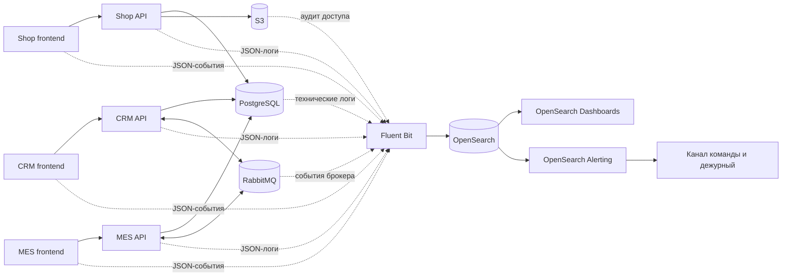

# Архитектурное решение по логированию

## Мотивация

Сейчас история заказа распределена между онлайн-магазином, CRM, MES, PostgreSQL, S3 и RabbitMQ. Единого места, где можно восстановить цепочку событий, нет. Поэтому поддержка опирается на рассказ клиента, а разработчики долго ищут, на каком шаге заказ остановился или потерялся.

Централизованное логирование позволит:

- найти заказ по `order_id` и увидеть его путь между системами;
- отличить ошибку приложения от задержки расчёта, базы данных или очереди;
- обнаруживать потерянные сообщения, повторную обработку и зависшие заказы;
- быстрее отвечать клиентам и передавать разработчикам точные данные;
- замечать массовые сбои раньше, чем о них сообщат пользователи.

Логи не заменяют метрики и распределённый трейсинг. Метрики показывают масштаб проблемы, трейсинг связывает один запрос между сервисами, а логи объясняют, что именно произошло. Во всех трёх инструментах должны использоваться одинаковые `trace_id`, `correlation_id`, `order_id` и `message_id`.

### Метрики эффекта

После внедрения будут измеряться:

1. Среднее время расследования обращения по заказу — ожидается сокращение минимум на 50%.
2. Доля обращений, для которых причина найдена по логам без запроса дополнительных данных у клиента — целевое значение не ниже 80%.
3. Количество заказов, которые находятся в одном промежуточном статусе дольше допустимого времени — должно устойчиво снижаться.
4. Доля сообщений RabbitMQ, для которых подтверждена успешная обработка или известна причина попадания в DLQ — целевое значение не ниже 99,9%.
5. Среднее время от появления массовой ошибки до оповещения ответственного сотрудника — не более 5 минут.

## Приоритет внедрения

Одновременно покрыть все компоненты логированием и трейсингом не получится, поэтому работа делится на этапы.

1. **MES API, CRM API и RabbitMQ.** Это главный приоритет для логирования и трейсинга: через эту цепочку проходят расчёт стоимости, создание производственного заказа и изменения производственных статусов. Здесь наиболее вероятны потеря сообщения, повторная обработка и зависание заказа.
2. **Shop API.** Нужно связать отправку заказа клиентом с его передачей в MES и отличать проблему при приёме заказа от проблемы дальнейшей обработки.
3. **PostgreSQL и S3.** Их технические и аудит-логи помогут находить медленные запросы, ошибки соединений и проблемы доступа к 3D-моделям. Содержимое запросов и файлов собираться не будет.
4. **Shop, CRM и MES frontend.** Сначала собираются только ошибки интерфейса и ключевые пользовательские действия. Полный трейсинг браузерных запросов добавляется после серверной цепочки, иначе значительная часть трассы всё равно останется невидимой.

## Предлагаемое решение

Все приложения формируют структурированные JSON-логи и пишут их в стандартный поток вывода или локальный файл с ротацией. На каждом сервере Fluent Bit читает эти записи, добавляет название системы, окружение и версию приложения, удаляет запрещённые поля и отправляет данные в OpenSearch по TLS. При временной недоступности OpenSearch Fluent Bit использует дисковый буфер и повторные попытки с ограничением объёма.

OpenSearch хранит логи в отдельных индексах. OpenSearch Dashboards предоставляет поиск, сохранённые представления и дашборды. Встроенный OpenSearch Alerting выполняет периодические запросы и отправляет уведомления в рабочий канал команды, а критические уведомления — дежурному сотруднику.



Fluent Bit разворачивается рядом с каждым приложением. Для управляемых PostgreSQL и S3, где установка агента невозможна, журналы аудита и технические логи забираются через доступный облачный экспорт в выделенную точку сбора Fluent Bit. Сборщик должен иметь собственную сервисную учётную запись только на чтение.

### Единый формат

Обязательные поля каждой записи:

- `@timestamp` — время в UTC в формате ISO 8601;
- `level`, `service`, `component`, `environment`, `service_version`;
- `event_name`, `event_outcome`, `message`;
- `trace_id`, `span_id`, `correlation_id`;
- `order_id`, если событие относится к заказу;
- `message_id`, `event_id` и `causation_id` для событий RabbitMQ;
- `request_id`, `http_method`, `route`, `status_code`, `duration_ms` для HTTP;
- `error_type`, `error_code`, `retry_count` при ошибке;
- `actor_type` и обезличенный `actor_id_hash`, если действие выполнил пользователь или оператор.

Поля, которые неприменимы к событию, не добавляются. Имена полей и событий фиксируются в общем справочнике. Идентификаторы не должны содержать имя, телефон или электронную почту.

Пример записи:

```json
{
  "@timestamp": "2026-08-02T16:20:14.382Z",
  "level": "INFO",
  "service": "mes-api",
  "environment": "prod",
  "event_name": "order.price_calculation.completed",
  "event_outcome": "success",
  "order_id": "ord-7f12",
  "trace_id": "4bf92f3577b34da6a3ce929d0e0e4736",
  "correlation_id": "ord-7f12",
  "duration_ms": 128430,
  "model_size_bytes": 1843200,
  "polygon_count": 245000
}
```

### Какие логи собирать

**Shop, CRM и MES frontend**

- ошибки JavaScript, необработанные исключения и отклонённые Promise;
- ошибки сетевых запросов с маршрутом, кодом ответа, длительностью и `request_id`;
- ошибки загрузки страниц и ключевых компонентов;
- ключевые действия в заказе: отправка формы, подтверждение производства, взятие заказа в работу и изменение статуса;
- версия frontend, тип браузера и тип устройства без полного User-Agent и IP-адреса.

Обычные клики, введённый текст и содержимое форм не собираются. Frontend отправляет события через защищённую серверную точку приёма с ограничением частоты, размера пакета и допустимой схемой.

**Shop API, CRM API и MES API**

- начало и результат обработки HTTP-запроса;
- создание заказа и каждое допустимое изменение его статуса;
- начало, завершение и длительность расчёта стоимости;
- вызовы между системами и их результат;
- публикация и обработка сообщений RabbitMQ;
- обращение к S3 и результат операции;
- бизнес-отказы, повторные попытки, тайм-ауты и исключения;
- запуск, остановка, готовность приложения и изменение конфигурации без значений секретов.

**RabbitMQ**

- подключение и отключение producer и consumer;
- создание, удаление и изменение очередей, обменников и привязок;
- публикация с publisher confirm, получение, `ack`, `nack`, повторная доставка и попадание в DLQ;
- ошибки соединения, авторизации, маршрутизации и превышение лимитов;
- `queue`, `routing_key`, `message_id`, `correlation_id`, попытка обработки и длительность без тела сообщения.

**PostgreSQL**

- запуск, остановка, восстановление и переключение состояния;
- ошибки соединений, аутентификации, блокировки и deadlock;
- медленные запросы с длительностью, именем операции и нормализованным шаблоном;
- изменения схемы и действия администраторов;
- превышение лимита подключений и ошибки записи.

Параметры запросов, полные тексты с пользовательскими значениями и результаты запросов не сохраняются.

**S3**

- загрузка, чтение, удаление и изменение метаданных объекта;
- успешность операции, длительность, код ответа, бакет и технический `object_id`;
- изменение политики бакета и прав доступа;
- отказ в доступе, отсутствующий объект и ошибки хранилища.

Имя файла, URL с подписью и содержимое 3D-модели не сохраняются.

### События уровня INFO

INFO используется для значимых успешных бизнес-событий и этапов интеграции. Он не должен содержать каждую внутреннюю функцию или SQL-запрос.

| Источник | Событие `event_name` | Дополнительные поля |
|---|---|---|
| Shop frontend | `order.form.submitted` | `order_id`, `request_id`, `frontend_version` |
| Shop frontend | `model.upload.completed` | `order_id`, `model_size_bytes`, `upload_duration_ms`; без имени и содержимого файла |
| Shop API | `order.created` | `order_id`, `channel` (`b2c` или `partner_api`), `actor_id_hash` |
| Shop API | `order.status.changed` | `order_id`, `previous_status`, `new_status`, `actor_type` |
| Shop API | `order.submitted` | `order_id`, `trace_id`, `request_id` |
| Shop API | `model.metadata.saved` | `order_id`, `object_id`, `model_size_bytes`, `polygon_count` |
| Shop API | `mes.request.completed` | `order_id`, `operation`, `status_code`, `duration_ms` |
| CRM API | `order.received` | `order_id`, `source`, `message_id` |
| CRM API | `order.status.changed` | `order_id`, `previous_status`, `new_status`, `actor_type` |
| CRM API | `manufacturing.approved` | `order_id`, `actor_id_hash` |
| CRM API | `order.closed` | `order_id`, `close_reason`, `actor_type` |
| MES API | `price_calculation.started` | `order_id`, `model_size_bytes`, `polygon_count` |
| MES API | `price_calculation.completed` | `order_id`, `duration_ms`, `calculation_version` |
| MES API | `order.status.changed` | `order_id`, `previous_status`, `new_status`, `actor_type` |
| MES API | `manufacturing.started` | `order_id`, `actor_id_hash` |
| MES API | `manufacturing.completed` | `order_id`, `duration_ms` |
| MES API | `order.packaging.started` | `order_id`, `actor_id_hash` |
| MES API | `order.shipped` | `order_id`, обезличенный `delivery_id` |
| API | `http.request.completed` | `request_id`, `route`, `method`, `status_code`, `duration_ms`; только для ключевых маршрутов |
| RabbitMQ producer | `message.published` | `message_id`, `event_id`, `correlation_id`, `queue`, `routing_key`, `publisher_confirmed` |
| RabbitMQ consumer | `message.received` | `message_id`, `correlation_id`, `queue`, `redelivered`, `retry_count` |
| RabbitMQ consumer | `message.processed` | `message_id`, `correlation_id`, `duration_ms`, `event_outcome` |
| RabbitMQ consumer | `message.acknowledged` | `message_id`, `queue`, `duration_ms` |
| S3 | `object.operation.completed` | `operation`, `object_id`, `bucket`, `size_bytes`, `duration_ms`, `status_code` |
| Приложения | `application.started` | `service_version`, `instance_id`, `environment` |
| Приложения | `application.stopped` | `service_version`, `instance_id`, `reason` |

Смена статуса логируется в той системе, которая является владельцем перехода. Запись создаётся только после успешной фиксации изменения. Если затем публикуется интеграционное событие, оно получает тот же `trace_id` и `correlation_id`, но отдельный уникальный `message_id`.

### Другие уровни

- **TRACE** — в production выключен. Временно включается только для одного компонента и ограниченного набора `trace_id` во время сложного расследования, максимум на 30 минут.
- **DEBUG** — подробности выполнения и безопасные технические параметры. В production по умолчанию выключен; включается на ограниченное время с семплированием и автоматическим возвратом уровня.
- **WARN** — операция пока не сорвана, но есть риск: медленный запрос, повторная доставка, первая повторная попытка, приближение к лимиту, неизвестный статус, задержка расчёта свыше 10 минут.
- **ERROR** — операция завершилась неуспешно: необработанное исключение, исчерпаны повторы, сообщение отправлено в DLQ, не удалось изменить статус, недоступны PostgreSQL или S3. Сохраняются тип ошибки и очищенный stack trace.
- **FATAL** — приложение не может продолжать работу: повреждена обязательная конфигурация, невозможно подключиться к критическому хранилищу после периода запуска, завершился основной процесс.

Ожидаемые клиентские ошибки валидации не записываются как ERROR. Они агрегируются как INFO или WARN по коду причины, чтобы не создавать ложный шум.

## Безопасность и доступ

До отправки записи Fluent Bit применяет allowlist разрешённых полей. Дополнительно pipeline OpenSearch удаляет или маскирует поля, которые могли пройти ошибочно. В логи запрещено помещать:

- содержимое и фрагменты 3D-файлов;
- токены, пароли, ключи API, cookie и заголовки авторизации;
- платёжные данные;
- полные ФИО, адреса, телефоны, электронную почту и другие полные персональные данные;
- тела HTTP-запросов и сообщений RabbitMQ;
- подписанные ссылки S3 и параметры SQL-запросов.

Пользовательские и операторские идентификаторы хешируются с отдельным секретом. IP-адрес, если он нужен для расследования безопасности, маскируется и хранится только в защищённом аудит-индексе.

Передача выполняется по TLS, данные на дисках OpenSearch и в буферах Fluent Bit шифруются. Сервисные учётные записи получают минимальные права только на запись в свои индексы. Доступ сотрудников предоставляется через корпоративную аутентификацию и ролевую модель:

- **Поддержка** — поиск по `order_id`, `correlation_id` и сохранённые представления бизнес-событий без stack trace и защищённых полей;
- **Разработчик** — технические логи только своих систем в dev, release и production без security-аудита;
- **DevOps/SRE** — технические логи всех систем, настройка агентов, индексов и алертов;
- **Специалист по безопасности** — аудит доступа и security-индексы;
- **Администратор OpenSearch** — управление кластером, но не выдача себе бизнес-доступа без согласования.

Все входы, поисковые запросы, выгрузки и изменения ролей аудируются. Массовая выгрузка отключена для поддержки и разработчиков. Доступ пересматривается раз в квартал и отзывается автоматически при смене роли или увольнении.

## Политика хранения

Для production, release и dev используются разные шаблоны индексов. Это исключает смешивание данных и позволяет задавать разные сроки хранения. Индексы production разделены по источнику и типу данных.

| Шаблон индекса | Данные | Хранение | Rollover и лимит |
|---|---|---:|---|
| `prod-shop-api-logs-*` | Shop API | 90 дней | 1 день или 30 ГБ на primary shard |
| `prod-crm-api-logs-*` | CRM API | 180 дней | 1 день или 30 ГБ |
| `prod-mes-api-logs-*` | MES API | 180 дней | 1 день или 30 ГБ |
| `prod-frontend-logs-*` | три frontend с полем `service` | 30 дней | 1 день или 15 ГБ |
| `prod-rabbitmq-logs-*` | RabbitMQ и интеграционные события | 180 дней | 1 день или 30 ГБ |
| `prod-postgresql-logs-*` | ошибки, аудит и медленные запросы | 30 дней | 1 день или 20 ГБ |
| `prod-s3-audit-*` | метаданные операций S3 | 365 дней | 7 дней или 20 ГБ |
| `prod-security-audit-*` | доступ к логам и изменения прав | 365 дней | 7 дней или 20 ГБ |
| `release-logs-*` | все release-системы | 30 дней | 1 день или 20 ГБ |
| `dev-logs-*` | все dev-системы | 14 дней | 1 день или 10 ГБ |

Политики Index State Management автоматически выполняют rollover, переводят старые production-индексы в тёплое хранилище и удаляют их по окончании срока. Размер primary shard удерживается в диапазоне 10–30 ГБ. Для каждого шаблона задаётся квота; её пересматривают после первого месяца по фактическому объёму.

При заполнении диска OpenSearch на 70% создаётся предупреждение, на 80% останавливается приём низкоприоритетных DEBUG-логов и увеличивается семплирование frontend-событий. Удалять аудит до окончания срока нельзя. На 90% включается штатная защита OpenSearch от записи, поэтому до этого порога дежурный должен расширить хранилище или устранить источник аномального потока.

## Поиск, дашборды и алертинг

В OpenSearch Dashboards создаются:

- карточка заказа: все записи по `order_id` в хронологическом порядке;
- цепочка сообщения: публикация, получение, обработка, `ack`, повторные доставки и DLQ по `message_id`;
- дашборд ошибок по сервису, версии, маршруту и типу исключения;
- дашборд длительности расчёта стоимости и времени между статусами;
- дашборд медленных запросов PostgreSQL и ошибок S3;
- дашборд полноты логирования: события без `order_id`, `trace_id` или `message_id`.

Алерты делятся на два уровня:

- **критический:** рост ERROR/FATAL более чем в пять раз относительно обычного уровня за 5 минут; любое сообщение в DLQ; отсутствие consumer; нет успешных обработок заказов 10 минут при наличии входящих сообщений; более 20 заказов без следующего ожидаемого события сверх допустимого времени;
- **предупреждение:** p95 расчёта стоимости выше 10 минут в течение 15 минут; повторная доставка более 1% сообщений; рост HTTP 5xx выше 2% за 10 минут; медленный запрос PostgreSQL дольше 2 секунд; заполнение диска OpenSearch выше 70%.

Критический алерт отправляется дежурному и создаёт инцидент. Предупреждение приходит в канал команды и создаёт задачу, если сохраняется дольше 30 минут. В уведомлении указываются сервис, окружение, интервал, сохранённый поиск и несколько безопасных идентификаторов, но не чувствительные данные.

Для поиска аномалий используются детекторы OpenSearch Anomaly Detection и простые правила:

- резкий рост создания заказов относительно того же времени предыдущих дней;
- необычное увеличение событий от одного `actor_id_hash`, партнёра или маршрута;
- изменение обычного соотношения `order.created` и `order.received`;
- появление новых типов ошибок после релиза;
- рост времени между публикацией и обработкой сообщения;
- отсутствие ожидаемого перехода статуса при наличии предыдущего события.

Аномалия сама по себе не считается доказательством атаки или сбоя. Сначала создаётся предупреждение с данными для проверки. Автоматическая блокировка допустима только для заранее проверенных правил защиты на API-шлюзе.

## Выбор технологии

| Критерий | ELK | OpenSearch | Loki |
|---|---|---|---|
| Лицензия и контроль | Часть возможностей Elastic имеет коммерческие ограничения | Открытая Apache 2.0, без привязки к одному поставщику | AGPLv3 для новых версий; управляемые возможности зависят от поставщика |
| Полнотекстовый поиск | Очень развитый | Очень развитый, совместимый с привычной моделью Elasticsearch | Основной поиск по labels; произвольный поиск по содержимому дороже |
| Структурированные JSON-логи | Отличная поддержка | Отличная поддержка, mappings и ingest pipelines | Поддерживаются, но модель ориентирована на поток и labels |
| Алертинг и аномалии | Развитые возможности, часть зависит от лицензии | Alerting и Anomaly Detection доступны в стеке | Обычно требует Grafana Alerting и дополнительных компонентов |
| Ролевая модель и аудит | Развитые, условия зависят от редакции | Встроенные роли, document/field-level security и аудит | Доступ чаще строится вокруг tenant и внешней авторизации |
| Стоимость хранения | Высокая при большом числе индексируемых полей | Сопоставима с ELK, управляется ISM и тёплыми индексами | Обычно ниже, так как индексируются в основном labels |
| Эксплуатационная сложность | Зрелый стек, но много компонентов | Единый поисковый и аналитический стек | Прост для дешёвого хранения, но для сложного анализа нужны Grafana и дополнительные сервисы |
| Подходящесть для расследования заказа | Высокая | Высокая: быстрый поиск по `order_id`, `trace_id`, `message_id` и полям событий | Средняя: важно заранее правильно выбрать labels, а идентификаторы заказов нельзя превращать в labels из-за высокой кардинальности |

Выбирается **OpenSearch**. Для текущей задачи важны сложный поиск по полям JSON, ролевая модель, аудит, встроенный алертинг и поиск аномалий. OpenSearch закрывает эти требования одним стеком и не требует коммерческой лицензии для базовых функций безопасности и анализа. Fluent Bit имеет готовый output-плагин для OpenSearch, а OpenSearch Dashboards подходит и поддержке, и инженерам.

Loki выгоднее по стоимости хранения и хорошо подходит для просмотра логов рядом с метриками, но расследование пути отдельного заказа требует частого поиска по полям с высокой кардинальностью. Такие поля нельзя безопасно делать labels, а поиск по содержимому будет менее удобным. ELK технически также подходит, но для проекта важнее открытая лицензия и предсказуемая доступность функций безопасности, алертинга и аномалий, поэтому OpenSearch предпочтительнее.
