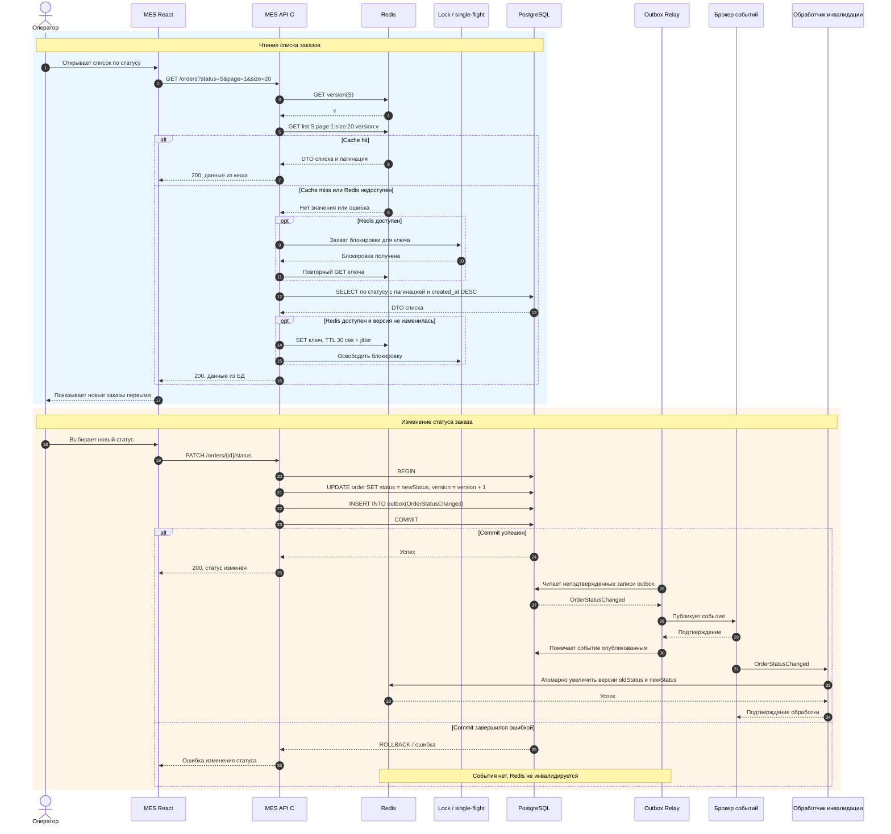

# Архитектурное решение по кешированию

## Мотивация

Дашборд MES часто читает один и тот же набор данных: последние заказы, отфильтрованные по статусу и разбитые на страницы. Сейчас каждый такой запрос выполняется в PostgreSQL. По мере роста числа заказов сортировка, фильтрация и подсчёт страниц занимают всё больше времени. Один экземпляр базы одновременно обслуживает чтение и запись, поэтому тяжёлые запросы дашборда замедляют не только интерфейс операторов, но и операции изменения заказов.

Кеширование должно:

- ускорить открытие дашборда и переключение между популярными статусами;
- снизить количество одинаковых запросов к PostgreSQL;
- освободить ресурсы базы для операций записи и других процессов MES;
- дать операторам быстрый доступ к самым новым заказам, от которых зависит распределение работы.

Кешировать нужно на стороне MES API результаты чтения списка заказов. В первую очередь это первые страницы по рабочим статусам, отсортированные по времени создания заказа по убыванию. Старые страницы запрашивают реже, поэтому кеширование всего архива даст мало пользы и займёт лишнюю память.

Кеш не является источником истины. Актуальные данные и история изменений остаются в PostgreSQL.

## Предлагаемое решение

### Общий подход

Предлагается добавить отдельный Redis и использовать серверное кеширование по паттерну Cache-Aside.

При чтении MES API сначала ищет готовый результат в Redis. Если значение найдено, API возвращает его клиенту. При промахе API читает данные из PostgreSQL, сохраняет результат в Redis на ограниченное время и возвращает его клиенту. Такой подход не требует менять основной путь записи заказа и позволяет внедрять кеш постепенно, начиная с наиболее востребованных запросов.

Серверное кеширование выбрано по следующим причинам:

- все операторы используют общий набор заказов, поэтому один результат можно переиспользовать между пользователями;
- сервер полностью контролирует ключи, срок хранения и инвалидацию;
- обновление статуса можно связать с очисткой кеша на стороне MES;
- данные не приходится долго хранить в браузерах и согласовывать между разными клиентами;
- Redis снижает нагрузку на PostgreSQL для всех экземпляров клиента сразу.

Клиентское кеширование подходит хуже. Браузер каждого оператора хранит собственную копию, поэтому первый запрос каждого клиента всё равно попадает в API и базу. Кроме того, сложнее быстро сообщить всем открытым браузерам об изменении статуса. Долгий клиентский TTL покажет устаревшие заказы, а короткий почти не снизит нагрузку. Допустимо оставить только кратковременное хранение состояния интерфейса, но не использовать его как основной кеш данных.

Cache-Aside предпочтительнее других серверных паттернов:

- **Write-Through** требует при каждой записи сразу обновлять все варианты списков: разные статусы, номера страниц и размеры страницы. Это усложняет транзакцию, увеличивает время изменения статуса и не гарантирует удобного обновления страниц, содержимое которых сдвигается после появления нового заказа.
- **Refresh-Ahead** заранее обновляет значения до истечения TTL. Для этого нужно прогнозировать востребованные комбинации фильтров и постоянно выполнять фоновые запросы. При большом числе ключей часть работы окажется лишней, а PostgreSQL получит дополнительную регулярную нагрузку. Паттерн также не решает сам по себе проблему немедленного устаревания после смены статуса.
- **Cache-Aside** создаёт только реально запрошенные значения, хорошо работает для преобладающего чтения и допускает отказ Redis без остановки MES.

### Ключи и данные

Ключ списка имеет вид:

`mes:orders:list:v1:status:{status}:page:{page}:size:{size}:sort:createdAtDesc:version:{version}`

Здесь:

- `v1` — версия формата кешируемого объекта;
- `status` — статус или нормализованный набор статусов;
- `page` и `size` — параметры пагинации;
- `createdAtDesc` — фиксированный порядок, при котором новые заказы идут первыми;
- `version` — текущая версия данных для статуса.

Текущая версия хранится отдельно:

`mes:orders:list-version:status:{status}`

Если запрос поддерживает несколько статусов, ключ строится из отсортированного набора статусов и версий каждого из них. Это исключает разные ключи для логически одинаковых фильтров.

В значение кеша входят:

- идентификатор и номер заказа;
- текущий статус;
- дата создания и дата последнего изменения;
- краткие производственные сведения, которые видны в строке дашборда;
- данные пагинации: номер и размер страницы, признак следующей страницы, при необходимости общее количество записей.

В Redis не нужно сохранять 3D-модели, файлы, полную историю заказа, платёжные реквизиты, адреса, телефоны и другие персональные данные, которые не используются в списке. Состав значения должен совпадать с минимальной DTO, возвращаемой дашборду. Доступ к Redis разрешается только MES API и служебным компонентам внутри закрытой сети; соединение и данные должны быть защищены средствами облачной инфраструктуры.

Кешируются только разрешённые размеры страницы, например 20, 50 и 100 записей, и первые 3–5 страниц рабочих статусов. Неограниченные размеры и произвольные варианты сортировки не кешируются, чтобы не допустить неконтролируемого роста числа ключей. Для Redis задаётся лимит памяти и политика вытеснения `allkeys-lru`.

### TTL

Базовый TTL списка — 30 секунд. К нему добавляется случайное отклонение от 0 до 10 секунд. Такой срок ограничивает время показа устаревших данных при задержке или ошибке инвалидации, но позволяет обслужить из кеша частые повторные открытия дашборда.

Для первой страницы активных статусов после измерения нагрузки TTL можно уменьшить до 10–20 секунд, если бизнесу потребуется более свежая информация. Увеличивать TTL следует только по результатам наблюдения за частотой изменений, долей попаданий в кеш и допустимой задержкой отображения.

Ограничения решения:

- в коротком интервале между фиксацией изменения в БД и обработкой события инвалидации кеш может вернуть прежний список;
- первая загрузка после промаха остаётся зависимой от скорости PostgreSQL;
- кеш не исправит медленный SQL-запрос, отсутствие подходящего индекса или слишком дорогой подсчёт общего количества записей;
- Redis потребует мониторинга памяти, времени ответа, доли попаданий и ошибок;
- решение рассчитано на списки дашборда, а не на кеширование всех данных заказа.

### Инвалидация

Основная стратегия — программная инвалидация по версии ключа после изменения статуса. В одной транзакции PostgreSQL MES API обновляет заказ и добавляет запись в transactional outbox. Только после успешного `COMMIT` отдельный обработчик публикует событие `OrderStatusChanged`. Получатель события увеличивает версии старого и нового статусов в Redis. Следующие чтения строят ключи уже с новыми версиями и не используют прежние списки.

Событие содержит идентификатор заказа, старый и новый статус, версию заказа и идентификатор события. Обработчик должен быть идемпотентным: повторная доставка одного события не должна приводить к неконтролируемому изменению версий. Для этого идентификатор обработанного события сохраняется либо используется атомарный Lua-скрипт с короткоживущей отметкой дедупликации.

Старые ключи становятся недоступными для чтения и удаляются по TTL. Это проще и надёжнее, чем искать все комбинации страниц. Если набор вариантов запроса останется небольшим, допустима альтернативная реализация: при создании ключа добавлять его в Redis Set для соответствующего статуса и после события удалять все связанные ключи. Версионирование предпочтительнее, потому что оно выполняется атомарно и не требует обхода большого набора ключей.

Короткий TTL используется как страховка: если событие задержалось или обработчик временно не смог обратиться к Redis, устаревшие данные всё равно исчезнут. Использовать только TTL хуже, потому что после смены статуса заказ может оставаться в неверном списке до конца срока хранения. Полная очистка всего Redis тоже не подходит: одно изменение уничтожит полезный кеш остальных статусов и вызовет всплеск запросов к базе. Обновление конкретного кешированного списка вручную ненадёжно, поскольку изменение одного заказа может сдвинуть несколько страниц сразу.

### Гонки, всплески нагрузки и отказ Redis

Версия в ключе защищает от гонки между заполнением кеша и изменением заказа. Если запрос начал читать данные со старой версией, а затем статус изменился, результат будет записан только под старым ключом. После инвалидации новые запросы используют новую версию и не увидят этот результат. При варианте с удалением связанных ключей нужно дополнительно проверять версию до и после чтения из БД, иначе запоздавший запрос может повторно положить устаревшее значение.

Чтобы при истечении популярного ключа множество запросов одновременно не обратились к PostgreSQL, MES API использует распределённую блокировку на короткое время или single-flight для одного ключа. Один запрос заполняет кеш, остальные недолго ожидают результат. Если ожидание превышено, запрос может обратиться к БД, но не должен бесконечно блокировать оператора. Случайная добавка к TTL не позволяет большому числу ключей истечь одновременно.

Redis не включается в обязательную транзакцию чтения. При тайм-ауте, ошибке подключения или отсутствии ключа MES API читает список напрямую из PostgreSQL и возвращает ответ. Ошибка записи в кеш также не должна превращать успешное чтение из БД в ошибку для пользователя. Для Redis задаются короткие тайм-ауты и circuit breaker, чтобы недоступный кеш не увеличивал задержку каждого запроса.

### Диаграмма последовательности

Инвалидация выполняется только по событию, появившемуся после успешной фиксации транзакции. Поэтому ошибка записи в PostgreSQL не удалит корректный кеш. Transactional outbox исключает ситуацию, когда изменение уже сохранено, но событие потеряно из-за сбоя MES API между `COMMIT` и публикацией.
